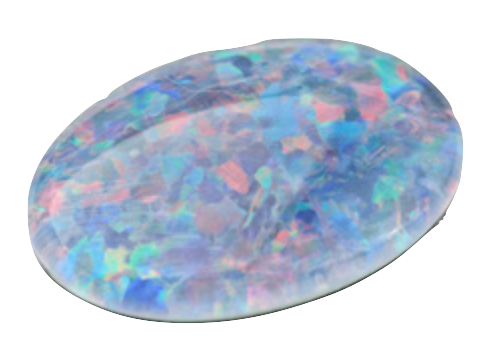

# Opal 
[](https://travis-ci.org/naqvis/opal)
[](https://github.com/naqvis/opal/releases)

`Crystal` CLI for working with container registries. CLI is developed using [Crystal Library `containercegistry.cr`](https://github.com/naqvis/containerregistry.cr/)

## Installation

To install `opal` download it from [releases page](https://github.com/naqvis/opal/releases) or compile latest version using:

> **Note:** crystal is required in order to compile opal.

```
git clone https://github.com/naqvis/opal
cd opal
shards build -v
```

Then setup `opal` binary in your system path.


## Usage

```
Opal is a tool for managing container images

Subcommands:
  append    Append contents of a tarball to a remote image
  config    Get the config of an image
  copy      Efficiently copy a remote image from src to dst
  cp        alias for copy
  delete    Delete an image reference from its registry
  digest    Get the digest of an image
  export    Export contents of a remote image as a tarball
  ls        List the tags in a repo
  manifest  Get the manifest of an image
  pull      Pull a remote image by reference and store its contents in a tarball
  push      Push image contents as a tarball to a remote registry
  rebase    Rebase an image onto a new base image
  rm        alias for delete
  validate  Validate that an image is well-formed

Options:
  -h, --help     show this help
  -v, --version  show version

(C) 2019 Ali Naqvi
```

## Known issues
- `rebase` is experimental and might break you if not used correctly. Read [rebase.md](./rebase.md) for more details.

## Contributing

1. Fork it (<https://github.com/naqvis/opal/fork>)
2. Create your feature branch (`git checkout -b my-new-feature`)
3. Commit your changes (`git commit -am 'Add some feature'`)
4. Push to the branch (`git push origin my-new-feature`)
5. Create a new Pull Request

## Contributors

- [Ali Naqvi](https://github.com/naqvis) - creator and maintainer
